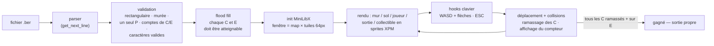

# so_long

 -purple)

Jeu 2D en vue du dessus rendu avec la MiniLibX. Le joueur ramasse tous les collectibles de la map puis atteint la sortie ; le compteur de mouvements est affiché dans le shell à chaque pas. La map vient d'un fichier `.ber` entièrement validé avant l'ouverture de la fenêtre.


## Le format de map `.ber`

| Char | Signification | Règle |
|:---:|---|---|
| `1` | mur | la map doit être entièrement fermée par des murs |
| `0` | sol | — |
| `P` | position de départ du joueur | exactement un |
| `E` | sortie | au moins une |
| `C` | collectible | au moins un |

```
1111111111
1P0C000001
1000111C01
1C000000E1
1111111111
```

## Pipeline



Avant tout rendu, un flood fill depuis le spawn du joueur vérifie que chaque collectible et la sortie sont atteignables. Toute map invalide (mur ouvert, élément manquant, objet inaccessible, ligne malformée) est rejetée avec un message `Error` — ni crash, ni fuite.

## Contrôles

| Touche | Action |
|:---:|---|
| `W` `A` `S` `D` / flèches | se déplacer |
| `ESC` / croix de la fenêtre | quitter proprement |

## Structure

```
solong/
├── srcs/
│   ├── map.c             # parsing & validation du .ber
│   ├── path_rect.c       # accessibilité par flood fill
│   ├── element_wall.c    # règles des éléments de la map
│   ├── game.c            # setup MLX & rendu
│   ├── player.c          # déplacements, collisions, compteur
│   └── utils*.c
├── maps/                 # maps valides & invalides
├── img/                  # sprites XPM
├── mlx/                  # MiniLibX
└── libft/                # libft + ft_printf + get_next_line
```

## Compilation & lancement

```bash
sudo apt install libx11-dev libxext-dev
make
./so_long maps/map3.ber
```
