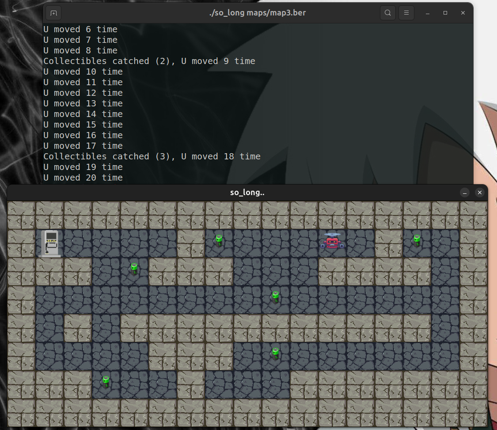
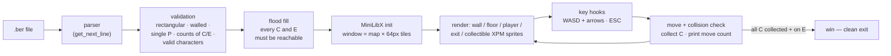

# so_long

 -purple)

2D top-down game rendered with MiniLibX. The player collects every collectible on the map then reaches the exit; the move count is printed to the shell at every step. The map comes from a `.ber` file that is fully validated before the window opens.



## The `.ber` map format

| Char | Meaning | Rule |
|:---:|---|---|
| `1` | wall | map must be fully enclosed by walls |
| `0` | floor | — |
| `P` | player spawn | exactly one |
| `E` | exit | at least one |
| `C` | collectible | at least one |

```
1111111111
1P0C000001
1000111C01
1C000000E1
1111111111
```

## Pipeline



Before any rendering, a flood fill from the player's spawn verifies that every collectible and the exit are reachable. Any invalid map (open wall, missing element, unreachable item, malformed line) is rejected with an `Error` message — no crash, no leak.

## Controls

| Key | Action |
|:---:|---|
| `W` `A` `S` `D` / arrows | move |
| `ESC` / window ✕ | quit cleanly |

## Structure

```
solong/
├── srcs/
│   ├── map.c             # .ber parsing & validation
│   ├── path_rect.c       # flood-fill reachability
│   ├── element_wall.c    # map element rules
│   ├── game.c            # MLX setup & rendering
│   ├── player.c          # movement, collisions, counter
│   └── utils*.c
├── maps/                 # valid & invalid maps
├── img/                  # XPM sprites
├── mlx/                  # MiniLibX
└── libft/                # libft + ft_printf + get_next_line
```

## Build & run

```bash
sudo apt install libx11-dev libxext-dev
make
./so_long maps/map3.ber
```
